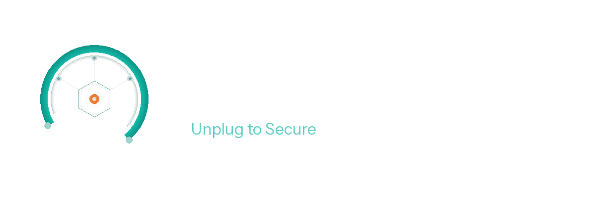

<p align="center">
  
</p>

<h1 align="center">ArcSign</h1>

<p align="center">
  <em>A USB-only multi-chain cold wallet you can audit instead of trust.</em>
</p>

[](LICENSE)
[](docs/reproducible-builds.md)
[](SECURITY.md)
[](CONTRIBUTING.md)
[](https://github.com/Jason-chen-taiwan)

ArcSign is an open-source desktop cold wallet for Bitcoin and 6 EVM chains.
Private keys are generated and stored only on a USB device. The `.arcsign`
encrypted backup file replaces paper seed phrases — it's AES-256 encrypted
at export, so a stolen backup file isn't a stolen wallet.

## Why open source

Cold wallets ask you to trust them with your savings. **We don't think you
should have to.**

- Every line of code that touches your keys is public.
- Every release is built reproducibly — clone the source at the matching
  tag, run `make build-reproducible`, and the SHA-256 should match
  the published `SHA256SUMS`. If it doesn't, something was tampered with.
  See [`docs/reproducible-builds.md`](docs/reproducible-builds.md).
- Every official on-chain address (Pro NFT, Referral, swap referrer) is
  a compile-time constant — printed at startup, documented at
  [`OFFICIAL_ADDRESSES.md`](OFFICIAL_ADDRESSES.md), and verifiable
  against BscScan.

Apache 2.0 licensed. Fork-friendly with a small trademark policy — see
[`TRADEMARK.md`](TRADEMARK.md).

## Features

- **Multi-chain HD wallet** — Bitcoin + 6 EVM chains
  (Ethereum, BSC, Polygon, Arbitrum, Optimism, Base).
- **USB cold storage** — private keys live on the USB, never on the host.
- **`.arcsign` encrypted backup** — AES-256 at export. No paper seed phrases.
- **DEX swap aggregator** — OpenOcean + KyberSwap parallel quotes,
  picks the best route automatically.
- **Token approvals manager** — view and revoke ERC-20 approvals across
  6 chains. Pro users get batch revoke.
- **NFT gallery** — cross-chain ERC-721 / ERC-1155 display.
- **DeFi positions** — liquid staking (stETH, ankrETH, ankrBNB) with
  real-time APY.
- **WalletConnect** — sign transactions from cold storage.
- **Pro membership** — optional 30 USDT/year NFT for advanced features.

## Architecture

ArcSign is a desktop app whose private keys never leave the USB device.
The UI is a Tauri (Rust) shell hosting a React frontend; all wallet logic
— key derivation, signing, swap routing, on-chain reads — lives in a Go
shared library loaded over a C FFI boundary. Nothing security-sensitive
runs in JavaScript.

### Layered overview

```
┌─────────────────────────────────────────────────────────────────────┐
│  Dashboard  —  React 18 + TypeScript + Vite + Tailwind + Zustand      │
│                                                                       │
│  components/  hooks/  stores/ (dashboardStore · walletSessionStore ·  │
│  sessionStore)                          services/tauri-api.ts (invoke)│
└───────────────────────────────┬───────────────────────────────────────┘
                                │  Tauri v2 `invoke` (capabilities model)
                                ▼
┌─────────────────────────────────────────────────────────────────────┐
│  Tauri shell (Rust)  —  src-tauri/src/commands/  (15 command files)   │
│  wallet · transaction · swap · provider · membership · usb · auth ·   │
│  security · walletconnect · websocket · app …                         │
│                         ffi/bindings.rs  →  libloading                │
└───────────────────────────────┬───────────────────────────────────────┘
                                │  C FFI  (CString in / CString out, JSON)
                                ▼
┌─────────────────────────────────────────────────────────────────────┐
│  libarcsign.dylib / .so / .dll   —   Go shared library (CGO)          │
│                                                                       │
│  internal/lib/  FFI exports, split by domain:                         │
│    exports_wallet · _transaction · _swap · _signing · _address ·      │
│    _provider · _membership · _app · _dev                              │
│                                                                       │
│  internal/  core logic:  wallet (BIP39/44 HD) · crypto · security ·   │
│             services · provider (on-chain reads)                      │
│  src/chainadapter/  unified tx interface  (bitcoin/ · ethereum/)      │
│  src/swap/  DEX aggregator  (kyberswap/ · oneinch/ · openocean/)      │
└──────────────┬───────────────────────────────────┬────────────────────┘
               │ signed tx broadcast               │ read on-chain data
               ▼                                   ▼
      8 chains: Bitcoin + 7 EVM             provider abstraction (below)
```

### Data flow

1. React calls `services/tauri-api.ts` → `invoke(...)` → a Rust command in
   `src-tauri/src/commands/` → `ffi/bindings.rs` → a Go FFI export in
   `internal/lib/`.
2. The Go library does the real work: HD key derivation (BIP39/44), signing,
   swap routing, and on-chain reads. Results return as JSON back up the same
   path.
3. `ChainAdapter` (`src/chainadapter/`) gives one interface over **Bitcoin + 7
   EVM chains** (Ethereum, Polygon, Arbitrum, Optimism, Base, BSC, Avalanche).
4. Zustand stores hold UI state; `analytics.ts` sends tier heartbeats to a
   Cloudflare Worker.

### Cross-chain swaps

`src/swap/aggregator.go` queries KyberSwap, 1inch and OpenOcean **in parallel**
(`GetBestRoute`) and picks the best quote. Adapters live under
`src/swap/{kyberswap,oneinch,openocean}/`.

### Provider data path (reading balances / tokens / NFTs / transfers)

On-chain reads go through one **`WalletDataProvider` abstraction**
(`internal/provider/`), not per-endpoint `switch` blocks. Adding a provider is a
one-place change: implement the interface, add a wrapper, register it, and map
the chain.

```
            GetTokenBalances / GetNFTs / GetAssetTransfers
                              │
                   ┌──────────┴──────────┐
                   │ WalletDataProvider  │   interface (provider-agnostic
                   │  (registry + chains)│   Simplified* return types)
                   └──────────┬──────────┘
        ┌──────────────┬──────┴───────┬───────────────────┐
        ▼              ▼              ▼                   ▼
   Alchemy WDP    NodeReal WDP    Glacier WDP     DefiLlama (price enrich)
   5 EVM chains   BSC (BEP-20)    Avalanche       no key — fills USD values
   key (degraded  key (native     no key          for whatever the providers
   without one)   BNB w/o key)    (anon tier)     left at 0
```

| Chain(s) | Provider | API key | Without a key |
|---|---|---|---|
| Ethereum · Polygon · Arbitrum · Optimism · Base | **Alchemy** | required for full data | **degraded path**: native coin + curated common tokens (incl. staking receipts) via public RPC + Multicall3; NFTs / history need the key |
| BSC | **NodeReal** | required for BEP-20 token list | native BNB still shows via public BSC RPC |
| Avalanche | **Glacier** (Avalanche Data API) | none (anonymous tier) | full token/NFT data |
| *all of the above* | **DefiLlama** | none | fills USD prices the providers returned as 0 |

**Progressive API keys (no-key path).** A brand-new user with **no Alchemy key**
still sees basic assets. The degraded path (`internal/provider/degraded.go`)
queries, over public RPCs only:

- the **native coin** balance (`eth_getBalance`), and
- a **curated common-token whitelist** (`common_tokens.go`) — stablecoins,
  wrapped coins, the chain's own token, major DeFi tokens, and **liquid-staking
  receipts** (stETH / ankrETH / eETH / ankrBNB) — batched into **one
  `eth_call` per chain via Multicall3** (`multicall.go`), with RPC fallback.

USD values are filled by **DefiLlama** (no key). Full token *discovery*, NFTs
and transaction history require an Alchemy key — surfaced in-app as a soft
"add a key to unlock more", not an error. There is **no hard-coded API key** in
the repo; provider keys live only in the per-USB encrypted provider config.

### No-key vs. with-key, at a glance

| Capability | No key | + Alchemy key |
|---|---|---|
| Native balances (ETH/MATIC/BNB/AVAX/…) | ✅ | ✅ |
| Common tokens (USDC/USDT/DAI/WETH/…) | ✅ (whitelist) | ✅ (full discovery) |
| Liquid-staking receipts (stETH/eETH/…) | ✅ | ✅ |
| USD prices (DefiLlama) | ✅ | ✅ |
| Arbitrary / long-tail token discovery | ❌ | ✅ |
| NFT gallery | Avalanche only | ✅ all EVM chains |
| Transaction history | ❌ | ✅ |

For deeper detail see [`docs/architecture.md`](docs/architecture.md) and
[`CLAUDE.md`](CLAUDE.md).

## Downloading

Pre-built binaries are published as **GitHub Releases**:
https://github.com/arcsignio/arcsign/releases

The `latest` tag always points to the newest stable release:
- macOS: `releases/latest/download/ArcSign-macOS-ARM64.dmg`
- Windows: `releases/latest/download/ArcSign-Windows-x64.msi`
- Linux: `releases/latest/download/ArcSign-Linux-x64.AppImage`

Verify your download:

```bash
# 1. Download SHA256SUMS from the release
curl -fsSL -o SHA256SUMS \
  https://github.com/arcsignio/arcsign/releases/latest/download/SHA256SUMS

# 2. Verify the binary you downloaded matches
shasum -a 256 -c SHA256SUMS

# 3. Optionally: rebuild yourself and confirm the hash matches
#    See docs/reproducible-builds.md
```

> `SHA256SUMS` is available for v1.4.0 onwards (the first open-source
> release). It covers both the installer bundles and the Go shared
> library (`libarcsign.dylib` / `.so` / `.dll`) so you can verify the
> reproducible-build chain end-to-end.

## Building from source

```bash
# Prerequisites: Go 1.21+, Node 20+, Rust 1.70+
git clone https://github.com/arcsignio/arcsign.git
cd arcsign

# Build the Go shared library
make build-lib-macos    # or build-lib-linux / build-lib-windows

# Build the Dashboard
cd dashboard
npm install
npm run tauri:dev       # development
npm run tauri:build     # production app bundle
```

For reproducible builds (matching the official `SHA256SUMS`):

```bash
make build-reproducible
shasum -a 256 dashboard/src-tauri/libarcsign.dylib
```

## Security

Found a vulnerability? **Do not open a public GitHub issue.**

Email `security@arcsign.io` (PGP key in [`SECURITY.md`](SECURITY.md)).

Initial response within 24 hours for security issues (see SLA below).
Full disclosure policy, threat model, and bug bounty status (currently
Hall-of-Fame credit + non-monetary support only; monetary bounty will
launch when the project is sustainable enough to fund it) in
[`SECURITY.md`](SECURITY.md).

## Contributing

ArcSign is a **one-maintainer project**, created and maintained by
[**@Jason-chen-taiwan**](https://github.com/Jason-chen-taiwan). We don't
pretend otherwise. Realistic response times:

| Type | Initial acknowledgement | Resolution |
|---|---|---|
| Security vulnerability (`security@arcsign.io`) | within 24 hours | depends on severity |
| Bug reports (GitHub issues) | within 72 hours | best-effort |
| Pull requests | within 1 week | strict acceptance |
| Feature requests | best-effort | no SLA |
| Translations | open an issue first | see below |

PRs are reviewed strictly — roughly 80% are rejected to keep maintenance
manageable. **Please read [`CONTRIBUTING.md`](CONTRIBUTING.md) before
opening a PR**, particularly the "What we do NOT accept" section.

TL;DR:
- Open an issue first for any non-trivial change (>50 lines).
- All commits must be signed off with DCO: `git commit -s -m "..."`.
- Tests required for non-trivial changes.
- Changes to `internal/wallet/constants.go` (official addresses) are
  auto-blocked and require explicit maintainer review.

Good first issues are tagged [`good-first-issue`](https://github.com/arcsignio/arcsign/issues?q=is%3Aissue+is%3Aopen+label%3Agood-first-issue).
Translation contributions are welcome but please open a coordination
issue first — we'd rather have 2 well-maintained languages than 8 stale ones.

## License & trademarks

Source code is licensed under the Apache License 2.0 — see
[`LICENSE`](LICENSE) and [`NOTICE`](NOTICE).

"ArcSign" and the ArcSign logo are unregistered trademarks of the ArcSign
project. You may freely refer to the project by name; you may **not** ship
a fork under a name containing "ArcSign". See [`TRADEMARK.md`](TRADEMARK.md).

## Project links

| What | Where |
|---|---|
| Website | https://arcsign.io |
| Downloads | https://github.com/arcsignio/arcsign/releases |
| GitHub | https://github.com/arcsignio/arcsign |
| Issues | https://github.com/arcsignio/arcsign/issues |
| Discussions | https://github.com/arcsignio/arcsign/discussions |
| Twitter / X | [@ArcSignWallet](https://twitter.com/ArcSignWallet) |
| Discord | https://discord.gg/WTyQakx4pb |
| Security | security@arcsign.io ([PGP](docs/pgp-pubkey.asc)) |
