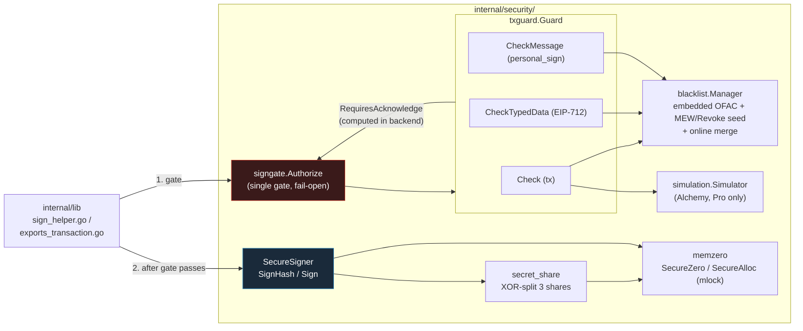

# ArcSign Architecture

This document is the deep-dive companion to the Architecture section of the
[README](../README.md). It is a **complete, subsystem-level map**: every major
module, its responsibility, key files, public interface, and the end-to-end
flows that tie them together.

> **One-line model:** Dashboard (Tauri / React) → C FFI → Go shared library.
> Private keys never leave the USB device, and nothing security-sensitive runs
> in JavaScript — all key derivation, signing, risk judgment, and swap routing
> happen in Go.

**Reading guide.** Sections 1–2 give the layered picture and the request
pipeline. Section 3 is the subsystem catalog (Go core). Section 4 covers the
outer layers (FFI exports, Rust shell, React). Section 5 traces the key user
flows end to end. Section 6 is a quick "where things live" map.

> Module paths drift as code evolves; treat file:line references as a starting
> point, not gospel. The responsibilities and flows are the durable part.

---

## 1. Layers

### Whole-project overview

One picture of the entire system: three layers (React → Rust → Go), the major
subsystems in each, the main data flows, and the external world (USB, public
RPC, indexers, dApps). Deep-dives for each subsystem are in §3; per-topic
diagrams (signing, USB storage, read-on-chain) are inline there.

```mermaid
flowchart LR
    subgraph ext_top["External — user-facing"]
        dapp["dApp / mint page"]
        user["User"]
    end

    subgraph react["① Dashboard — React 18 / TypeScript (presentation only)"]
        direction TB
        comps["components · hooks (useSignGate)<br/>stores (Zustand)"]
        assets["assets list<br/>aggregateTokens · treemap · DeFi · NFT"]
        tapi["services/tauri-api.ts (invoke)"]
        cs["clearsign (viem decode, advisory)"]
        wc["walletconnect handlers"]
        comps --- tapi
        assets --- comps
        wc --- tapi
        cs -.-> comps
    end

    subgraph rust["② Tauri shell — Rust (thin serialized bridge)"]
        direction TB
        cmds["commands/*.rs (15)"]
        queue["ffi/queue.rs<br/>single serialized worker"]
        bind["ffi/bindings.rs (libloading)"]
        ws["websocket/ :9527<br/>(mint-page sign requests)"]
        cmds --> queue --> bind
        ws --> queue
    end

    subgraph go["③ libarcsign — Go shared library (all asset logic)"]
        direction TB
        exp["internal/lib · exports_*.go (//export surface)"]
        subgraph core["internal/ core"]
            direction TB
            wallet["wallet · hdkey · bip39<br/>(BIP-39/44 HD)"]
            crypto["crypto · storage · backup<br/>(Argon2id + AES-256-GCM)"]
            seclgate["signing security gate<br/>signgate · txguard · blacklist · simulation"]
            keyprot["key protection<br/>SecureSigner (XOR-split) · memzero"]
            provider["provider<br/>balances (no-key) · NFT/history<br/>· approvals risk"]
            app["app · session · membership<br/>· ratelimit · audit"]
            rpcreg["rpc registry<br/>keyless endpoints + failover<br/>(shared management layer)"]
            misc["contacts · txlabels · abicache<br/>· dev mode (-tags dev)"]
        end
        mods["src/chainadapter (tx: BTC + 7 EVM)<br/>src/swap (OpenOcean + KyberSwap)"]
        exp --> core
        exp --> mods
        provider -->|"keyless RPC"| rpcreg
        mods -->|"tx RPC + gas"| rpcreg
        %% signing flow: gate first, then derive key, protect it, then sign
        exp -->|"sign request"| seclgate
        seclgate -->|"pass → derive"| wallet
        wallet -->|"private key"| keyprot
        keyprot -->|"signed hash / sig"| mods
    end

    subgraph extworld["External — chains & data (third-party)"]
        usb[("USB device<br/>encrypted .enc + wallet.json")]
        rpc["public RPC endpoints (keyless)<br/>publicnode · binance dataseed · avax public"]
        idx["indexers (Alchemy / NodeReal / Glacier)"]
        chains["Bitcoin + 7 EVM chains"]
        dex["OpenOcean / KyberSwap"]
        prices["DefiLlama prices"]
    end

    user --> comps
    dapp -->|"WalletConnect"| wc
    dapp -->|"WS :9527"| ws

    tapi -->|"Tauri invoke"| cmds
    bind -->|"C FFI (CString/JSON, GoFree)"| exp

    crypto <-->|"atomic read/write"| usb
    wallet -.->|"mnemonic.enc"| usb
    rpcreg -->|"resolves & calls (failover)"| rpc
    provider -->|"balances: Multicall3 aggregate3<br/>over the pool"| rpc
    provider -->|"NFT/history (key)"| idx
    provider -->|"prices"| prices
    provider -->|"flat balances + USD"| assets
    mods -->|"broadcast signed tx"| chains
    mods -->|"swap quotes"| dex
    rpc --> chains

    style react fill:#1a2a3a,stroke:#2980b9
    style rust fill:#2a2520,stroke:#b8772a
    style go fill:#1a2a1a,stroke:#27ae60
    style seclgate fill:#3a1a1a,stroke:#c0392b,color:#fff
    style keyprot fill:#3a1a1a,stroke:#c0392b,color:#fff
    style usb fill:#3a1a1a,stroke:#c0392b,color:#fff
```



> **The throughline:** a UI action crosses three layers (React → Rust → Go) but
> every asset-touching decision happens in Go. The Rust shell is a thin,
> serialized bridge; React is presentation only. Private keys live encrypted on
> the USB and are reconstructed for ~1–5 ms only, inside the Go security layer.

The same layering as ASCII, for reference:

```
┌─────────────────────────────────────────────────────────────────────────┐
│  Dashboard — React 18 + TypeScript + Vite + Tailwind + Zustand            │
│    components/  hooks/ (useSignGate …)  stores/ (dashboard·session·wallet) │
│    services/tauri-api.ts (invoke)  services/{clearsign,walletconnect}/     │
└───────────────────────────────┬───────────────────────────────────────────┘
                                │  Tauri v2 `invoke` (capabilities model)
                                ▼
┌─────────────────────────────────────────────────────────────────────────┐
│  Tauri shell (Rust) — src-tauri/src/                                      │
│    commands/*.rs (15 files)  →  ffi/queue.rs (single serialized worker)   │
│    →  ffi/bindings.rs (libloading)        websocket/ (127.0.0.1:9527)     │
└───────────────────────────────┬───────────────────────────────────────────┘
                                │  C FFI  (CString in / JSON *C.char out, GoFree)
                                ▼
┌─────────────────────────────────────────────────────────────────────────┐
│  libarcsign.{dylib,so,dll} — Go shared library (CGO, c-shared)            │
│    internal/lib/  exports_*.go (11 domain files, the //export surface)    │
│    internal/      wallet · crypto · security · provider · rpc · app …      │
│    src/chainadapter/  (separate module)   src/swap/  (in root module)      │
└──────────────┬────────────────────────────────────────┬───────────────────┘
               │ signed tx broadcast                     │ read on-chain data
               ▼                                         ▼
        Bitcoin + 7 EVM chains                  provider abstraction (§3.6)
```

**Module boundaries.** The repo is **two** Go modules:
`github.com/arcsignio/arcsign` (the root — `internal/` **and** `src/swap`) and
`github.com/arcsignio/arcsign/src/chainadapter` (its own `go.mod`). The
dependency direction is **root → chainadapter → (nothing back)**, which is why
`chainadapter` defines its own minimal `Signer` interface and cannot import the
root's `SecureSigner` (production injects it at the boundary). `src/swap` lives
under `src/` but has **no** `go.mod` — it is part of the root module, alongside
`internal/`.

### Why a Go shared library behind FFI

All asset-touching logic (key derivation, signing, risk gating, swap routing,
on-chain reads) lives in Go, behind a C FFI boundary, for three reasons:
**security** (nothing sensitive in JS, which is the easiest layer to tamper
with — change JS, hit a different code path, call the FFI directly), **reuse**
(the same library can back a future mobile app or CLI), and **auditability**
(one place to review the security-critical code). The Rust shell is a thin,
serialized bridge; React is presentation only.

---

## 2. Request flow (end to end)

Every UI action follows the same pipeline:

```
React component
  → services/tauri-api.ts   invoke("command_name", { …args })
  → Rust  commands/<domain>.rs   #[tauri::command] async fn
  → ffi/queue.rs   LazyWalletQueue → mpsc → single "wallet-queue-worker" thread
  → ffi/bindings.rs   WalletLibrary.<fn>()  (libloading Symbol)
  → Go  //export Fn(*C.char) -> *C.char     internal/lib/exports_*.go
  → internal/ core logic
  ← JSON FFIResponse{success,data,error}  bubbles back up the same path
```

**Two invariants make this safe:**

1. **Single serialized worker.** All Go FFI calls funnel through one dedicated
   OS thread (`ffi/queue.rs`, `WalletQueue` → `wallet-queue-worker`), using only
   `std::sync` (no Tokio in the worker — this sidesteps macOS thread
   restrictions on CGO calls). The Go library is non-reentrant; this guarantees
   thread-safe access. Async commands bridge in via `spawn_blocking` on a
   oneshot. `LazyWalletQueue` spawns the worker on first use (from an async
   context, after startup).

2. **CString in / JSON out, freed by GoFree.** Each export takes a JSON params
   `*C.char` and returns a heap-allocated JSON `FFIResponse` `*C.char`; Rust
   copies it to a Rust `String` and calls `GoFree` to release the Go-side
   allocation. Payloads are capped at 1 MB at the boundary (`safeGoString`).

---

## 3. Subsystem catalog — Go core

Each subsystem below lists **responsibility · key files · public interface ·
notable flow**.

### 3.1 HD wallet & key derivation

**Responsibility.** Generate/import BIP-39 mnemonics, derive BIP-32/44 HD keys,
pre-generate multi-coin addresses, and persist wallet metadata + encrypted
mnemonic per USB.

**Key files.**
- `internal/services/bip39service/` — mnemonic generate/validate, `MnemonicToSeed`
  (PBKDF2, 2048 rounds, optional passphrase → 64-byte seed). 12 words = 128-bit,
  24 words = 256-bit entropy; English wordlist.
- `internal/services/hdkey/` — BIP-32 over `btcd/btcutil/hdkeychain` (Bitcoin
  mainnet params). `NewMasterKey`, `DerivePath` (`m/44'/coin'/0'/0/0`, `'` =
  hardened), `GetPrivateKey` (32-byte secp256k1).
- `internal/services/address/` — address formatting: `DeriveBitcoinAddress`
  (P2PKH base58), `DeriveEthereumAddress` (Keccak-256 of pubkey, last 20 bytes),
  `GenerateMultiCoinAddresses` (loops the coin registry).
- `internal/services/coinregistry/` — 22 coins. BTC = coinType 0 ("bitcoin"
  formatter); **all EVM coins share coinType 60 + "ethereum" formatter** (one
  secp256k1 address across the EVM family).
- `internal/services/wallet/` — `WalletService` orchestrator (create/import/
  load/restore/delete) with a 3-attempts/min rate limiter.
- `internal/models/` — `Wallet{ID,Name,…,EncryptedMnemonicPath,UsesPassphrase,
  AddressBook}`, `DerivedAddress{Symbol,CoinName,CoinType,Address,DerivationPath,…}`,
  `AddressBook{Addresses[]}`, `EncryptedMnemonic{Salt,Nonce,Ciphertext,Argon2*…}`.

**Public interface.** `bip39service.{GenerateMnemonic,ValidateMnemonic,MnemonicToSeed}`,
`hdkey.{NewMasterKey,DerivePath,GetPrivateKey}`, `wallet.{CreateWallet,
ImportWalletFromMnemonic,LoadWallet,RestoreWallet,ListWallets,DeleteWallet}`,
`address.GenerateMultiCoinAddresses`.

**Flow (derivation).** `mnemonic → MnemonicToSeed (seed zeroed via defer) →
hdkey.NewMasterKey → per-coin DerivePath m/44'/coin'/0'/0/0 → address`.

### 3.2 Crypto & storage

**Responsibility.** Authenticated encryption of mnemonics + arbitrary data;
USB-safe atomic writes; `.arcsign` / `.arcsign-bundle` export-import.

**Key files.**
- `internal/services/crypto/` — the **one scheme used everywhere**:
  **Argon2id (t=4, m=256 MiB, p=4, 32-byte key, 16-byte salt) + AES-256-GCM**
  (12-byte nonce, 16-byte tag). `EncryptMnemonic`/`DecryptMnemonic`, generic
  `Encrypt`/`Decrypt`, `SerializeEncryptedData` (binary:
  `[version][time][memory][threads][salt][nonce][ciphertext+tag]`), `ClearBytes`.
- `internal/services/storage/` — `AtomicWriteFile` (temp → `Sync` → `Chmod 0600`
  → atomic `Rename`; dirs 0700) for USB pull-out safety; USB detection + free space.
- `internal/services/backup/` — `.arcsign` export wraps the already-encrypted
  `mnemonic.enc` (no new password); `.arcsign-bundle` adds an **outer**
  `crypto.Encrypt(bundleJSON, password)` layer.

**Public interface.** `crypto.{EncryptMnemonic,DecryptMnemonic,Encrypt,Decrypt,
Serialize/DeserializeEncryptedData}`, `storage.AtomicWriteFile`,
`backup.{ExportBackup,ImportBackup,ExportAllBackups,ImportAllBackups}`.

> **Why `.arcsign` needs no export password.** The inner `mnemonic.enc` is
> already AES-256-GCM encrypted with a per-wallet Argon2id key (set at wallet
> creation). Export base64-wraps that blob; **import requires the original
> wallet password** to decrypt and verify ownership.

#### What lives on the USB, and how it's encrypted

Everything sensitive on the USB is encrypted at rest; nothing is stored in plain
text. All writes are atomic (temp → fsync → rename, `0600`) to survive a USB
pull-out mid-write.

```mermaid
flowchart TD
    subgraph usb["USB device — /Volumes/&lt;mount&gt;/"]
        direction TB
        subgraph wdir["&lt;walletUUID&gt;/"]
            mn["mnemonic.enc<br/>Argon2id(pw) + AES-256-GCM"]
            wj["wallet.json<br/>(public: name, AddressBook, paths)"]
        end
        pc["provider_config.enc<br/>(API keys: Alchemy/NodeReal)"]
        tt["touched_tokens.enc<br/>(table B — swap outputs / imports)"]
        ct["contacts.enc"]
        tl["txlabels (encrypted)"]
        ab["abi_cache.enc<br/>(clear-signing ABIs)"]
        ac["app_config.enc<br/>(identity, memberships)"]
    end

    pw["wallet password"] -->|"Argon2id t=4,m=256MiB,p=4"| key["32-byte key"]
    key -->|"AES-256-GCM"| mn
    apppw["app password"] -->|"AES-256-GCM"| pc & ac
    apppw --> tt & ct & tl & ab

    mn -->|"base64 wrap (already encrypted)"| arc[".arcsign backup file<br/>(no new password)"]
    mn2["all wallets"] -->|"+ outer crypto.Encrypt(password)"| bundle[".arcsign-bundle"]

    note["Restore: import REQUIRES the original<br/>wallet password to decrypt + verify"]
    arc -.-> note

    style usb fill:#1a2a1a,stroke:#27ae60
    style mn fill:#3a1a1a,stroke:#c0392b,color:#fff
    style key fill:#3a1a1a,stroke:#c0392b,color:#fff
```



One scheme everywhere: **Argon2id(t=4, m=256 MiB, p=4) + AES-256-GCM**. The
session provider-key uses a *different* scheme (HKDF + AES-GCM, no Argon2)
because its secret is a high-entropy session token, not a low-entropy password —
see §3.4.

### 3.3 Security layer — the signing gate & XOR-split key storage

**Responsibility.** A mandatory pre-sign security gate plus ephemeral XOR-split
private-key storage so a plaintext key exists for only ~1–5 ms.

**Key files.**
- `internal/security/secret_share.go` — **XOR-split.** `SplitSecret`: share1,
  share2 = `crypto/rand`; `share3 = secret ⊕ share1 ⊕ share2`; original zeroed.
  `Reconstruct` = XOR of all three. Shares use `SecureAlloc` (mlock best-effort).
- `internal/security/secure_signer.go` — `SecureSigner{shares,address,chainID}`.
  `SignHash`/`Sign` reconstruct the key, `defer SecureZero`, sign, zero on every
  path. `signEVM` = `ethcrypto.Sign`; `signBitcoin` = `btcec.SignCompact`.
  Implements `chainadapter.Signer`.
- `internal/security/memzero*.go` — `SecureZero`, `SecureAlloc/Free` (mlock),
  `SecureCompare` (constant-time).
- `internal/security/signgate/` — **the single mandatory gate.**
  `Authorize(ctx, *Guard, SignRequest)` → `nil` allows, `ErrBlocked` refuses.
  Dispatches by `SignKind` (Transaction/TypedData/Message). **Fail-open**: a nil
  guard or an uncheckable payload allows; it refuses only on an affirmative
  danger signal (`RequiresAcknowledge && !AcknowledgedRisk`).
- `internal/security/txguard/` — risk judgment. `Check` (tx: blacklist for
  everyone + simulation for Pro), `CheckTypedData` (EIP-712: flags non-canonical
  `verifyingContract` as `EIP712_MALFORMED_DOMAIN`; extracts
  spender/operator/to/token + verifyingContract and blacklist-checks them),
  `CheckMessage` (personal_sign: regex-scans for embedded `0x` addresses).
  **`RequiresAcknowledge` is computed here, in the backend** — never trusted
  from the frontend.
- `internal/security/blacklist/` — thread-safe address/domain maps; embedded
  offline seed (OFAC sanctioned + MEW/Revoke malicious spenders) so the first
  sign works offline; background `Update` merges online OFAC/ScamSniffer/MetaMask
  without overwriting the seed.
- `internal/security/simulation/` — Alchemy `simulateAssetChanges` (Pro only;
  ETH/Polygon/Arbitrum/Optimism/Base).

**Public interface.** `signgate.Authorize` (the entry point),
`security.{NewSecureSigner,SecureZero,EIP191Hash}`,
`txguard.{NewGuard,Check,CheckTypedData,CheckMessage,CheckDomain}`,
`blacklist.{NewManager,CheckAddress,CheckDomain,Update}`.

**Flow (the load-bearing invariant — gate BEFORE key derivation).**
For message/typed-data, `internal/lib/sign_helper.go`:
1. `signgate.Authorize(gateCtx[3s], initTxGuard(), req)` runs **first**;
   `ErrBlocked` → return before any key exists.
2. `deriveSecureSigner`: `RestoreWallet` (decrypt mnemonic, `defer zeroString`)
   → `LoadWallet` → `derivationPathFor` → `MnemonicToSeed` (`defer SecureZero`)
   → `NewMasterKey` → `DerivePath` → `GetPrivateKey`. **`GetPrivateKey` and
   `NewSecureSigner` are deliberately adjacent in one function** (no external
   hand-off) so the plaintext key is XOR-split + zeroed immediately. *This is
   intentionally NOT split into two layers — splitting would lengthen the
   plaintext key's lifetime.*
3. `SecureSigner.SignHash` reconstructs the key (~1–5 ms), signs, zeroes; v
   adjusted +27 for Ethereum.

The transaction path (`exports_transaction.go`) keeps its own decrypt/derive
(it signs via the multi-step ChainAdapter, a different shape than a single
hash) **but still calls `signgate.Authorize` first**. So there are two
key-derivation sites, but the invariant "every signing path gates before
touching a key" holds across all three signing exports and both transports
(WalletConnect + the localhost WebSocket).

#### Signing security flow (gate before key derivation)

Every signing path — `SignTransaction`, `SignMessage`, `SignTypedData`, from
either WalletConnect or the localhost WebSocket — converges on the same gate
before any private key is decrypted.

```mermaid
flowchart TD
    subgraph entry["Entry points (all signing paths)"]
        WC["WalletConnect handler<br/>eth_sendTransaction /<br/>eth_signTypedData_v4 / personal_sign"]
        WS["localhost WS :9527<br/>(mint page)"]
        UI["In-app SendTransaction /<br/>SwapTransaction / revoke"]
    end
    WC --> EXP
    WS --> EXP
    UI --> EXP
    EXP["FFI export<br/>SignTransaction / SignMessage / SignTypedData<br/>(internal/lib)"]
    EXP --> RL{"rate limit<br/>+ session valid?"}
    RL -->|"fail"| REJ1["return error<br/>(key untouched)"]
    RL -->|"ok"| GATE

    subgraph gatebox["signgate.Authorize — the mandatory gate"]
        GATE["assess by SignKind"]
        GATE --> CHK["txguard:<br/>Check / CheckTypedData / CheckMessage"]
        CHK --> BL["blacklist (free, embedded seed)<br/>+ EIP-712 verifyingContract normalization<br/>+ simulation (Pro only)"]
        BL --> RA{"RequiresAcknowledge<br/>&& !acknowledgedRisk?"}
    end
    RA -->|"yes — danger, not acknowledged"| REJ2["ErrBlocked → ErrBlacklisted<br/>(key NEVER derived)"]
    RA -->|"no / fail-open"| DERIVE

    subgraph derivebox["deriveSecureSigner — one function, no hand-off"]
        DERIVE["RestoreWallet (decrypt mnemonic)<br/>defer zeroString"]
        DERIVE --> SEED["MnemonicToSeed → NewMasterKey<br/>→ DerivePath → GetPrivateKey<br/>defer SecureZero(seed)"]
        SEED --> SPLIT["NewSecureSigner: XOR-split key into 3 shares<br/>(plaintext key zeroed immediately)"]
    end
    SPLIT --> SIGN["SecureSigner.SignHash / ChainAdapter.Sign<br/>key reconstructed ~1–5 ms, then zeroed"]
    SIGN --> OUT["signature → up the FFI chain"]

    style gatebox fill:#3a1a1a,stroke:#c0392b
    style derivebox fill:#1a2a3a,stroke:#2980b9
    style REJ2 fill:#c0392b,color:#fff
```



#### Security-layer modules (`internal/security/`)

How the security submodules relate. `signgate` is the only entry point;
`txguard` computes the risk verdict; `SecureSigner` holds the key.



### 3.4 Session, app state & rate limiting

**Responsibility.** App-level auth sessions (token + encrypted provider key,
never the plain password), per-wallet sessions, wallet locking by NFT tier,
rate limiting, and append-only audit logging.

**Key files.**
- `internal/app/session.go` — `SessionManager`. A `Session` stores public data
  + an **encrypted provider key**, never the password. Timeouts: 24 h absolute,
  2 h idle. Provider-key encryption: `AES-256-GCM` with key =
  `HKDF(SHA256(token), salt=serverPepper, info="session-key-v{n}")`, where
  `serverPepper` is 32 random bytes generated **fresh per app launch, never
  persisted** — so a leaked token alone can't decrypt. `calculateLockedWallets`
  locks the newest wallets beyond `WalletLimit(nftCount)`; `IsWalletLocked`
  blocks signing.
- `internal/app/wallet_session.go` — `WalletSessionManager`, 15-minute per-wallet
  sessions (verifies password via `RestoreWallet`, then clears the mnemonic).
- `internal/app/storage.go` — `VerifyAppPassword` (constant-time, ≥200 ms to
  resist timing attacks); `provider_config.enc` encryption.
- `internal/services/ratelimit/` — sliding-window per-walletID limiter. App
  unlock 5/2 min, wallet auth + signing 3/min, tx build/broadcast 10/min.
- `internal/services/audit/` — append-only NDJSON (0600, `Sync` per write):
  CREATE/IMPORT/ACCESS/DELETE/EXPORT/… operations.

**Public interface.** `SessionManager.{CreateSession,ValidateToken,GetProviderKey,
RecalculateLockedWallets,UpdateMembershipsAndRecalculate}`,
`WalletSessionManager.{CreateWalletSession,ValidateWalletToken}`,
`ratelimit.{AllowAttempt,ResetWallet}`, `audit.LogOperation`.

### 3.5 ChainAdapter (`src/chainadapter/` — separate module)

**Responsibility.** A unified, chain-agnostic transaction lifecycle (build →
estimate → sign → broadcast → query/subscribe) over Bitcoin (UTXO) and EVM
(account) chains.

**Key files.**
- `adapter.go` — the `ChainAdapter` interface + DTOs (`TransactionRequest`,
  `UnsignedTransaction`, `FeeEstimate`, `SignedTransaction`, `BroadcastReceipt`,
  `TransactionStatus`, `Capabilities`).
- `signer.go` — the minimal `Signer` interface (`Sign(payload,address)` +
  `GetAddress()`). Production injects `internal/security.SecureSigner` here.
- `ethereum/` — EVM impl, **parameterized by `networkID`**
  (1→ethereum, 56→bnb, 137→polygon, 42161→arbitrum, 10→optimism, 8453→base,
  43114→avalanche). Fee strategy chosen by chain: Legacy (BSC/Fantom),
  L2 (Arbitrum/Optimism/Base), else EIP-1559. `Build` resolves ERC-20 vs native
  via one source of truth (`ChainSpecific["token_address"]`; an invalid token
  address is a hard error, never a silent native fallthrough).
- `bitcoin/` — UTXO impl (largest-first selection, PSBT/`wire.MsgTx`).
- `rpc/` — JSON-RPC transport with round-robin failover + health-based circuit
  breaker (TLS ≥ 1.2). *(This is the chainadapter module's own RPC, distinct
  from `internal/rpc` — see §3.7.)*
- `storage/` — `TransactionStateStore` for broadcast idempotency.

**Public interface.** `ChainAdapter.{ChainID,Capabilities,Build,Estimate,Sign,
Broadcast,QueryStatus,SubscribeStatus}`.

**Flow (EVM build→sign→broadcast).** `Build` produces a `DynamicFeeTx`, computes
the signing hash, stores tx params in `ChainSpecific`. `Sign` validates signer
address == `From` and `ChainID` match, reconstructs the tx, calls
`signer.Sign(...)` (→ `SecureSigner`, 65-byte `R‖S‖V`), attaches the signature,
verifies the recovered sender, marshals to `SerializedTx`. `Broadcast` checks
the idempotency store, then `eth_sendRawTransaction` (treats "already known" as
success).

### 3.6 Provider data path (read-on-chain)

**Responsibility.** One unified read abstraction (balances / tokens / NFTs /
transfer history) with **feature-dimension routing** — balances are
decentralized (self-hosted, no key); NFTs/history use chain-specific indexers.
Also hosts offline token-approval risk classification.

**Key files.**
- `internal/provider/wallet_data_provider.go` — the `WalletDataProvider`
  interface (`GetTokenBalances`, `GetNFTs`, `GetAssetTransfers`) + `DegradedProvider`
  (reports no-key mode).
- `wallet_data_wrappers.go` — `alchemyWDP` / `nodeRealWDP` / `glacierWDP`.
- `wallet_data_registry.go` — provider-key → factory map; `LoadProviderAPIKey`.
- `chains.go` — `GetProviderForNetwork` (chain-dim, NFT/history) vs
  `GetBalanceProviderForNetwork` (always self-hosted).
- `degraded.go` / `multicall.go` — the self-hosted balance engine: public RPC
  pool + **Multicall3 `aggregate3` balanceOf** (same `0xcA11…CA11` address on
  every chain, per-endpoint fallback).
- `common_tokens.go` (table A — curated per-chain set) + `touched_tokens.go`
  (table B — per-USB AES-256-GCM encrypted store of swap outputs + manual
  imports, never leaves the device); `mergeTokensForNetwork` unions them.
- `defillama_client.go` — keyless USD price enrichment.
- `alchemy_client.go` / `bsctrace_client.go` / `glacier_client.go` — indexer
  clients.
- `spender_registry.go` / `malicious_spenders.go` / `approval_risk.go` — the
  approval-risk trio.

**Provider / key matrix.**

| Feature | Path | Provider(s) | Key |
|---|---|---|---|
| Balances (native + tokens), **all 7 chains** | self-hosted | public RPC pool + Multicall3 + DefiLlama | **none** |
| NFTs / tx history — ETH·Polygon·Arbitrum·Optimism·Base | indexer | **Alchemy** | required (else `unavailableProviders`) |
| NFTs / tx history — BSC | indexer | **NodeReal** (`nr_getTokenHoldings`/`nr_getNFTHoldings`) | required |
| NFTs / tx history — Avalanche | indexer | **Glacier** | none (anonymous) |

There is **no hard-coded API key** in the repo; provider keys live only in the
per-USB encrypted `provider_config.enc`.

**Approval-risk classification.** `ClassifyApprovalRisk` (pure function),
priority malicious > EOA > (known × unlimited quadrants): **red** = malicious /
EOA spender / unlimited-to-unknown; **yellow** = unlimited-to-known or
limited-to-unknown; **green** = limited-to-known. Signals gathered offline:
curated `spender_registry`, embedded MIT-only `malicious_spenders` blocklist,
and an `eth_getCode` EOA probe for unknown spenders only (memoized).

#### Read-on-chain routing (feature-dimension)

The same wallet read splits by **feature**, not by chain: balances always take
the keyless self-hosted path; NFTs and history need a third-party indexer.

```mermaid
flowchart TD
    req["FFI read export<br/>GetTokenBalances / GetNFTs / GetAssetTransfers"]
    req --> route{"which feature?"}

    route -->|"balances<br/>(all 7 chains)"| selfhosted
    route -->|"NFTs / tx history"| indexer

    subgraph selfhosted["self-hosted path — NO key"]
        direction TB
        collect["CollectBalanceAddresses<br/>+ merge table A (common_tokens)<br/>∪ table B (touched_tokens.enc)"]
        collect --> pool["internal/rpc registry<br/>keyless public RPC pool<br/>(primary + backups, failover)"]
        pool --> mc["Multicall3 aggregate3 balanceOf<br/>(0xcA11…CA11, per-endpoint fallback)"]
        mc --> price["DefiLlama price enrich<br/>(keyless)"]
    end

    subgraph indexer["indexer path — needs key (per chain)"]
        direction TB
        bucket["bucket addresses by provider"]
        bucket --> alchemy["Alchemy<br/>ETH·Polygon·Arbitrum·Optimism·Base"]
        bucket --> nodereal["NodeReal<br/>BSC"]
        bucket --> glacier["Glacier<br/>Avalanche (anonymous)"]
        keys["provider_config.enc<br/>(per-USB encrypted keys)"]
        keys -.->|"decrypt key"| alchemy
        keys -.->|"decrypt key"| nodereal
        miss["missing key →<br/>unavailableProviders (UI prompts)"]
        alchemy -. no key .-> miss
        nodereal -. no key .-> miss
    end

    selfhosted --> out1["balances + USD → UI"]
    indexer --> out2["NFTs / history → UI"]

    style selfhosted fill:#1a2a1a,stroke:#27ae60
    style indexer fill:#2a2a1a,stroke:#f39c12
    style keys fill:#3a1a1a,stroke:#c0392b,color:#fff
```



Note the two RPC layers: `internal/rpc` (the keyless balance pool, above) and
`src/chainadapter/rpc` (the transaction transport, with health-based failover).

#### Assets list — frontend aggregation & presentation

The backend returns a **flat list of (token × chain) balances**; turning that
into the assets list the user sees is **presentation** and lives in the frontend
(`dashboard/src/utils/aggregateTokens.ts`, consumed by `WalletDetail.tsx`). This
is allowed in JS because it touches no keys and makes no security decision — it
only groups, sums, and sorts.

**Aggregation rules (`aggregateTokens`).** Each row is grouped by a key:

| Token kind | Grouping | Why |
|---|---|---|
| Native coin (ETH/BNB/AVAX/…) | one row per symbol, **merged across chains** | the same asset on many chains is one holding |
| ERC-20 on the **trusted whitelist** (USDC/USDT/…) | one row per symbol, merged across chains | genuinely the same token across chains |
| ERC-20 **not** whitelisted | one row per **(canonical network, contract)** | keeps a fake same-named token (a scam "USDC") out of the real asset's row |

Rows sum `usdValue` + `balance` across their sources, mark `isMultiChain`, and
sort by total USD descending. The token-detail view expands a merged row into
its per-chain sources (one row per **canonical** network, so a chain reported
under two spellings — "BNB Chain"/"BSC" — collapses to one). Prices come from
DefiLlama (filled in by the backend, §3.6 balance path). Other asset surfaces —
`ChainAllocationTreemap` (per-chain allocation), `DefiPositions` (liquid-staking
receipts), and the NFT gallery — render off the same backend reads.

```mermaid
flowchart LR
    subgraph be["Go backend (no key for balances)"]
        gb["GetTokenBalances<br/>self-hosted RPC + Multicall3"]
        dl["DefiLlama price enrich"]
        gb --> dl
    end
    dl -->|"flat (token × chain) list + USD"| fe
    subgraph fe["React frontend (presentation only)"]
        agg["aggregateTokens<br/>native + whitelisted ERC-20 → merge by symbol<br/>unknown ERC-20 → per (chain, contract)"]
        agg --> list["assets list (sorted by USD)"]
        agg --> detail["token detail<br/>per-chain breakdown"]
        tree["ChainAllocationTreemap"]
        defi["DefiPositions (stETH/ankr…)"]
        nft["NFT gallery"]
    end
    dl -.->|"same reads"| tree & defi & nft
    style fe fill:#1a2a3a,stroke:#2980b9
```



### 3.7 RPC registry (`internal/rpc/`)

**Responsibility.** Centralized keyless public RPC endpoints (primary + backups
per chain), EVM chain-ID / fee-strategy metadata, and gas-price fetching.

**Key file.** `internal/rpc/registry.go` (guarded by `registry_test.go`).
`ChainInfo{ChainID,PrimaryRPC,BackupRPCs[],AlchemyNetwork,FeeStrategy}`.
Endpoints are **keyless public** (publicnode / binance dataseed / avax public).
Aliases share the same `*ChainInfo` pointer (e.g. `bnb`/`bsc-mainnet`→bscMainnet)
so `provider.registryChainFor` resolves internal ids by pass-through.
`GetGasPrice` applies a 1.1× buffer with per-chain default fallback. Failover
itself happens in consumers (chainadapter's HTTP client; the provider balance
path tries each endpoint, first success wins).

> **Two RPC layers.** `internal/rpc` (provider balance path) and
> `src/chainadapter/rpc` (chainadapter transport). `internalToRegistryChain` in
> `degraded.go` bridges provider network ids → `internal/rpc` keys.

### 3.8 Swap (`src/swap/` — part of the root module)

**Responsibility.** DEX aggregation across OpenOcean + KyberSwap with tier-based
routing.

**Key files.** `aggregator.go` (`Aggregator`, `QuoteParams`, `SwapQuote`, tier
logic, `resolveFreeQuote`/`resolveFreeTx`), `openocean/`, `kyberswap/`,
`oneinch/` (present but **not wired** into the aggregator — reference only).

**Public interface.** `Aggregator.{GetQuote,BuildSwapTransaction,
GetApprovalTransaction,CheckAllowance,GetTokens}`. Both active providers report
`RequiresKey:false`.

**Flow (tiers).**
- **Free:** OpenOcean (carries the 0.1% referrer fee → Treasury EOA). On
  OpenOcean failure → fall back to KyberSwap (`RouteType="standard-fallback"`,
  fee=0 — "a quote with no fee beats no quote"). `resolveFreeQuote` (quote) and
  `resolveFreeTx` (build) are symmetric so you never "see a price but can't swap".
- **Pro:** query both providers **in parallel** (`getBestRouteQuote`), pick the
  larger `ToAmount`, `RouteType="best"`, no fee.

> Both active clients set a browser `User-Agent` (`Mozilla/5.0 (compatible;
> ArcSign/…)`) — the default Go UA gets 403'd by Cloudflare bot management.

### 3.9 Membership / Pro / Referral

**Responsibility.** Pro-tier gating (on-chain NFT balance) and per-USB
device-bound membership records that drive the wallet limit.

**Key files.**
- `internal/wallet/constants.go` — **compile-time** addresses (BSC): Pro NFT,
  Referral, Swap Referrer (Treasury EOA) + fee rate. Intentionally
  non-configurable; forks produce different reproducible-build hashes.
- `internal/constants/business.go` — `WalletLimit(nftCount) = 1 + 3·nftCount`
  (free = 1, 1 NFT = 4).
- `dashboard/src/hooks/useMembership.ts` + `commands/membership.rs` — on-chain
  Pro check: `eth_call balanceOf(address)` against the Pro NFT contract over
  BSC RPC; `isPro = nftCount > 0`; loops `tokenOfOwnerByIndex` + `expiresAt` for
  expiry. Defaults to free tier on error.
- `internal/lib/exports_membership.go` — per-USB membership records
  (`MembershipBinding`), device-id hashing for contract binding, and session /
  wallet-session token management.
- `contracts/` — `ArcSignPro.sol` (ERC-721, 365-day expiry, 30 USDT mint,
  device binding cleared on transfer) + `ArcSignReferral.sol` (trustless code
  registry; commission settled off-chain).

### 3.10 Contacts, transaction labels & ABI cache

- **Contacts** — `internal/contacts/`: AES-encrypted `contacts.enc`,
  `Contact{Name,Address,Symbol,Notes,…}`, validated lengths.
- **Tx labels** — `internal/txlabels/`: AES-encrypted store keyed by
  `network:txHash`, upsert semantics.
- **ABI cache** — `internal/lib/exports_abicache.go` + `provider.AbiCacheStore`
  (per-USB AES-256-GCM `abi_cache.enc`). Backs frontend clear-signing; a
  store-open error is always a cache miss (never blocks), so clear-signing
  degrades gracefully.

### 3.11 Dev mode (build-gated)

`internal/lib/exports_dev.go` is `//go:build dev` — only compiled with
`-tags dev`, **excluded from release binaries** so auto-signing can't exist in
production. Provides in-memory dev sessions that auto-sign on trusted testnets
(sepolia, bsc-testnet) for Hardhat/Foundry workflows. UI lives in
`dashboard/src/pages/DeveloperMode/`.

---

## 4. Outer layers

### 4.1 Go FFI export surface (`internal/lib/`)

`exports.go` holds helpers only (lazy-init globals `initTxGuard` /
`initSwapAggregator` / `initSessionManager`, `ValidateUSBPath`, `safeGoString`,
`NewSuccessResponse`/`NewErrorResponse`, `GoFree`, `debugLog` — a **production
no-op**, and `init()` calls `DisableCoreDump()`). `errors.go` defines the
`ErrorCode` enum and `MapWalletError` (priority-ordered substring matching of
the Go error → a user-facing code). The `//export` surface, by domain:

| File | Domain | Representative exports |
|---|---|---|
| `exports_wallet.go` | wallet lifecycle | CreateWallet, ImportWallet, UnlockWallet, GenerateAddresses, Export/ImportBackupWallet, Export/ImportAllWallets, Rename/DeleteWallet, ListWallets |
| `exports_transaction.go` | transactions | BuildTransaction, **SignTransaction**, BroadcastTransaction, QueryTransactionStatus, EstimateFee, CheckTransactionSecurity |
| `exports_signing.go` | message/typed-data | **SignMessage**, **SignTypedData**, CheckTypedDataSecurity, CheckMessageSecurity |
| `exports_swap.go` | swaps | GetSwapQuote, BuildSwapTransaction, GetSwapApproval, CheckSwapAllowance, GetSwapTokens |
| `exports_app.go` | app + assets | InitializeApp, UnlockApp, GetTokenBalances, GetNFTs, GetTokenApprovals, AddTouchedToken |
| `exports_address.go` | book/labels/history | ListContacts, Add/Update/DeleteContact, Set/Get/DeleteTransactionLabel, GetAssetTransfers, ValidatePassphrase |
| `exports_provider.go` | provider config | Set/Get/List/DeleteProviderConfig |
| `exports_membership.go` | membership/sessions | GetMembershipStatus, *MembershipBinding, Create/Validate/RevokeSessionToken (+ wallet variants) |
| `exports_abicache.go` | clear-sign ABIs | Get/Set/ClearCachedAbi |
| `exports_dev.go` | dev mode (`-tags dev`) | CreateDevSession, DevSessionSign, Get/EndDevSession |

### 4.2 Rust Tauri shell (`dashboard/src-tauri/src/`)

- **`ffi/bindings.rs`** — `WalletLibrary` holds `Arc<Library>` + cached
  `Symbol` fn pointers; `load()` searches platform paths, logs the lib SHA-256,
  `transmute`s symbols to `'static` (safe — the lib lives for the process).
  `call_ffi_with_params` does CString→call→CStr→copy→`GoFree`→parse.
- **`ffi/queue.rs`** — `WalletQueue` (single `wallet-queue-worker` thread, the
  serialization invariant from §2) + `LazyWalletQueue` (the Tauri-managed state;
  spawns the worker on first use). `QueueMetrics` track depth/wait.
- **`main.rs`** — loads the library at startup (exits on failure), registers all
  commands in `invoke_handler`, and spins up the WebSocket server.
- **`commands/*.rs`** (15 files) — thin `#[tauri::command]` wrappers that route
  to `queue.<fn>(...).await`: `app`, `auth`, `wallet`, `transaction`, `swap`,
  `membership`, `provider`, `security`, `usb`, `walletconnect` (session
  persistence), `websocket_commands` (bridge WS sign requests to the UI), `dev_*`.
- **`websocket/`** — the **127.0.0.1:9527** server for the external mint page.
  Localhost-only (rejects non-loopback peers **and** validates the WS `Origin`
  header), `Ping`-authenticated. Sign requests (`SignTransaction`,
  `SignAndBroadcast`, `PersonalSign`, `SignTypedDataV4`) push a pending request
  to the UI over a oneshot channel (5-min timeout); the UI confirmation then
  invokes the same signing FFI as everything else. Recognizes the ArcSign Pro
  `mint()` selector for a friendly description.
- **`capabilities/default.json`** — Tauri v2 permission model (`core:default`,
  shell open, dialog, scoped `fs:*`).

### 4.3 React frontend (`dashboard/src/`)

**Presentation only — security lives in Go.** `useSignGate` calls the backend
`check_*_security`, then reads `requiresAcknowledge` straight from the backend
report via `isHighRiskSign`; it resets the ack on each new request and treats a
failed check as advisory (never blocking). The checkbox / disabled button is
informed-consent **UX**; the real gate is the backend signing export, which
re-runs the blacklist and refuses on `RequiresAcknowledge && !acknowledgedRisk`
before touching the key.

- **`services/tauri-api.ts`** — the typed `invoke(...)` layer (~2500 lines);
  defines the canonical `SecurityReport` type the sign gate consumes.
- **`services/clearsign/`** — calldata/typed-data decode via **viem** (+ Sourcify
  ABI fallback through the per-USB ABI cache). Allowed in the frontend because
  it is **advisory presentation**, not a gate.
- **`services/walletconnect/`** — dApp pairing + `methods/` handlers
  (`eth-send-transaction`, `eth-sign-typed-data`, `personal-sign`). Each fetches
  the advisory security report, shows a dialog, then routes back through
  Rust→FFI→Go with `acknowledgedRisk` plumbed through. Only signing methods are
  implemented (no read-only RPC proxying).
- **`stores/`** (Zustand) — `dashboardStore` (UI state, `persist`d incl.
  `usbPath`), `sessionStore` (app token, **in-memory only**, never localStorage),
  `walletSessionStore` (per-wallet tokens).
- **`services/analytics.ts`** — anonymous HMAC-signed tier heartbeat to a
  Cloudflare Worker; silent-fail, never affects functionality. *(The HMAC secret
  currently lives in JS — a known item to move to Rust in the v2 migration.)*
- **`components/`** — SendTransaction, SwapTransaction, StakingTransaction,
  TokenApprovals, NFTGallery, DefiPositions, TransactionHistory, the
  WalletConnect dialogs, wallet lifecycle (Create/Import/Detail/Backup),
  membership (Pro/Referral), and the sign-gate UI (`SignGateAcknowledge`,
  `ClearSignSummary`).

---

## 5. Key user flows

Each step names the real entry point; intermediate Rust/queue hops are implied
by §2.

### 5.1 Create wallet
1. `WalletCreate.tsx` collects name, password, word count, optional passphrase.
2. → FFI `CreateWallet` (`exports_wallet.go`): validate USB path, zero
   password/passphrase on return.
3. `WalletService.CreateWallet`: generate mnemonic → encrypt → write
   `<usb>/<uuid>/mnemonic.enc` → derive multi-coin addresses → write
   `wallet.json`.
4. `RecalculateLockedWallets` (a new wallet may lock others past the limit).
5. Return `{walletId, name, mnemonic, createdAt}`; the mnemonic is shown **once**
   and the serialized response is zeroed after return.

### 5.2 Sign & send a transaction
1. UI → `build_transaction` → an `UnsignedTransaction` (gas/fee estimated).
2. Advisory `checkTransactionSecurity` → `txguard.Check` → `SecurityReport`
   (UI renders it; `useSignGate` toggles the ack checkbox).
3. → FFI `SignTransaction`: rate limit → session validate →
   **`signgate.Authorize(KindTransaction)` (the unbypassable gate)** → wallet-lock
   check → reconstruct tx → `deriveSecureSigner` (XOR-split, `VerifyEVMAddress`)
   → `ChainAdapter.SignTransaction` (key live ~1–5 ms) → zero.
4. → `broadcast_transaction` → RPC → txHash.

### 5.3 Sign EIP-712 typed data via WalletConnect (the phishing gate)
1. dApp sends `eth_signTypedData_v4` → `signTypedDataHandler`.
2. Reject if address locked / mismatched; `decodeTypedData` for the clear-signing
   summary; advisory `checkTypedDataSecurity` → `txguard.CheckTypedData`
   (`verifyingContract` normalization + blacklist of spender/operator).
3. `requestSignature` dialog → user approves with `acknowledged`.
4. → FFI `SignTypedData` with `acknowledgedRisk` → **same `signgate.Authorize`
   (`KindTypedData`)**; danger + !ack → `ErrBlocked`. The exact typed-data JSON
   is the canonical payload for **both** the check and the sign, so the gate
   judges what is actually signed.
5. Sign via `SecureSigner.SignHash` → return signature to the dApp.
   *(The localhost:9527 WS path converges on this same FFI.)*

### 5.4 Get a swap quote + execute
1. UI → FFI `GetSwapQuote`: dynamic gas, free-tier referrer fee config (Pro
   skips it), `Aggregator.GetQuote` (30 s timeout, OpenOcean → KyberSwap
   fallback / Pro parallel best-route).
2. If `needsApproval`: `CheckSwapAllowance` / `GetSwapApproval` → an ERC-20
   `approve` tx → signed via §5.2.
3. `BuildSwapTransaction` → `SignTransaction` (§5.2, full gate) → broadcast. The
   swap-output token is recorded via `AddTouchedToken` (table B) so future
   balance reads include it.

### 5.5 Read balances (no-key path)
1. UI → FFI `GetTokenBalances`: session validate; **does not open
   `provider_config.enc`** (balances need no key).
2. Verify wallet password (`RestoreWallet`), load AddressBook.
3. `CollectBalanceAddresses` (all 7 chains → self-hosted) + best-effort table B.
4. `GetSelfHostedTokenBalancesWithExtra`: public RPC pool + Multicall3
   `aggregate3 balanceOf`, no key.
5. `EnrichPricesWithDefiLlama` → totals + `unavailableProviders` → UI.

### 5.6 View & revoke token approvals
1. UI → FFI `GetTokenApprovals`: **opens `provider_config.enc`** and needs the
   Alchemy key (the `eth_getLogs` Approval-event scan has no key-free fallback;
   a missing key returns a clear actionable error).
2. Scan Approval events + `allowance`; each spender is risk-classified offline
   (`ClassifyApprovalRisk`) → red/yellow/green.
3. Revoke = build `approve(spender, 0)` calldata to the token → §5.2 (build →
   gate → sign → broadcast). Pro users get batch revoke.

### 5.7 Export / import `.arcsign` backup
1. **Export** → FFI `ExportWallet`: **no password** (the inner `mnemonic.enc`
   is already encrypted) → base64 backup blob → UI writes the `.arcsign` file
   (e.g. to a second USB).
2. **Import** → FFI `ImportBackupWallet`: **password required** to decrypt and
   verify ownership → restore into a new UUID wallet dir.
3. Bulk variants: `ExportAllWallets` / `ImportAllWallets` (the bundle adds an
   outer encryption layer).

---

## 6. Where things live (quick map)

```
internal/
  lib/            FFI //export surface (exports_*.go) + sign_helper.go
  wallet/         official contract constants
  models/         Wallet / AddressBook / DerivedAddress / EncryptedMnemonic
  services/       bip39service · hdkey · address · coinregistry · wallet ·
                  crypto · storage · backup · ratelimit · audit
  security/       secret_share · secure_signer · memzero · signgate/ ·
                  txguard/ · blacklist/ · simulation/
  app/            SessionManager · WalletSessionManager · app config/storage
  provider/       WalletDataProvider abstraction · degraded/multicall balance
                  engine · common/touched tokens · indexer clients · approval risk
  rpc/            keyless public RPC registry + gas price
  contacts/  txlabels/   encrypted address book + tx labels
  constants/      WalletLimit business rules

src/
  chainadapter/   (own go.mod) unified tx interface — ethereum/ · bitcoin/ · rpc/
  swap/           (root module) DEX aggregator — openocean/ · kyberswap/ · oneinch/

dashboard/
  src/            React — components/ · hooks/ · stores/ · services/{tauri-api,
                  clearsign,walletconnect,analytics}
  src-tauri/src/  Rust — commands/*.rs · ffi/{bindings,queue}.rs · websocket/ ·
                  capabilities/

contracts/        ArcSignPro.sol · ArcSignReferral.sol (+ testnet variants)
```

For the security-judgment-in-backend rule and the provider data-path details in
even more depth, see [`CLAUDE.md`](../CLAUDE.md).
